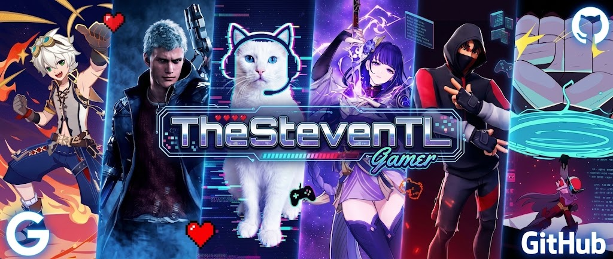
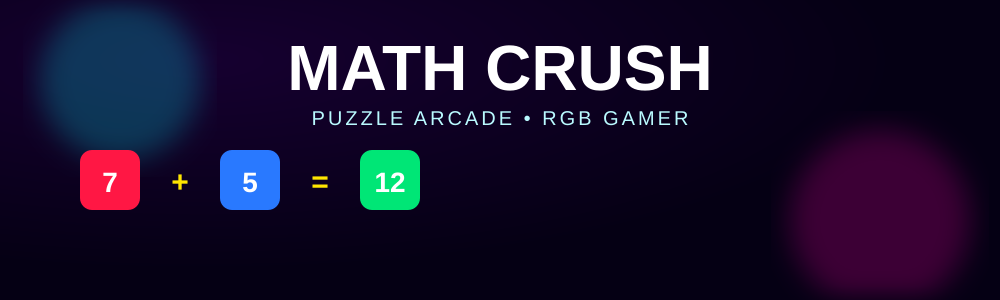
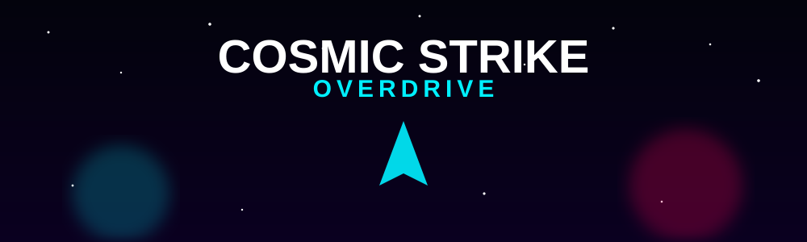
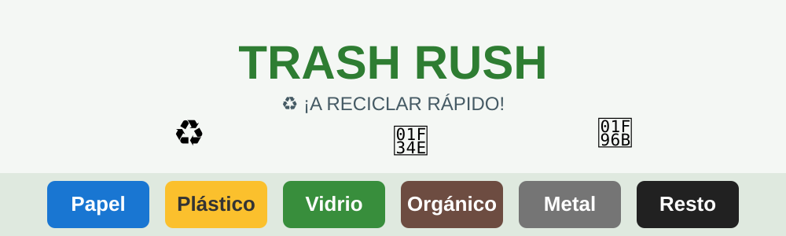
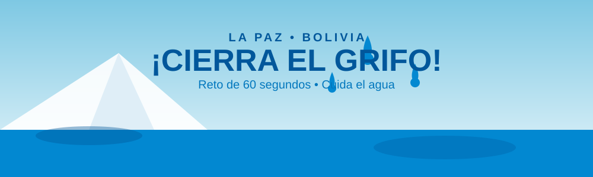
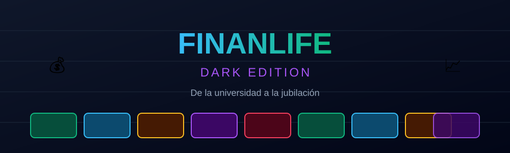

<p align="center">
  
</p>

<h1 align="center">🎮 Mi Portafolio de Game Development</h1>

<p align="center">
  
  
</p>

<p align="center">
  <a href="#-sobre-mí">Sobre mí</a> •
  <a href="#-galería-de-videojuegos">Galería</a> •
  <a href="#-tecnologías">Tecnologías</a> •
  <a href="#-estructura-del-repositorio">Estructura</a>
</p>

---

## 👋 Sobre mí

¡Hola! Soy **Steven** ([@TheStevenTL](https://github.com/TheStevenTL)), estudiante de **Game Development**.

Este repositorio reúne los prototipos de videojuegos que desarrollé durante las primeras clases de la asignatura, cada uno explorando una mecánica, un género y un propósito distinto — desde puzzles matemáticos hasta experiencias narrativas con impacto social.

---

## 🕹️ Galería de videojuegos

<table>
<tr>
<td width="50%" valign="top">

### 🧮 [Math Crush](./games/math-crush)


Puzzle arcade de matemática rápida: combina números vecinos para formar el objetivo antes de que se acabe el tiempo.

**Género:** Puzzle / Arcade &nbsp;|&nbsp; **Motor:** HTML5 + JS
🔗 [Ver proyecto](./games/math-crush) &nbsp;|&nbsp; ▶️ <a href="https://TheStevenTL.github.io/MiPortafolioGameDevelopment/games/math-crush/" target="_blank" rel="noopener">Jugar</a>

</td>
<td width="50%" valign="top">

### 🚀 [Cosmic Strike: Overdrive](./games/cosmic-strike-overdrive)


Shoot 'em up espacial: pilota tu nave a través de 3 sectores hostiles y derrota a 3 jefes finales.

**Género:** Shooter &nbsp;|&nbsp; **Motor:** HTML5 Canvas + JS
🔗 [Ver proyecto](./games/cosmic-strike-overdrive) &nbsp;|&nbsp; ▶️ <a href="https://TheStevenTL.github.io/MiPortafolioGameDevelopment/games/cosmic-strike-overdrive/" target="_blank" rel="noopener">Jugar</a>

</td>
</tr>
<tr>
<td width="50%" valign="top">

### 💬 [ECHOES: El Precio de un Clic](./games/echoes-el-precio-de-un-clic)


Novela visual interactiva sobre ciberbullying y responsabilidad digital, con decisiones que cambian el desenlace.

**Género:** Adventure / Narrativo &nbsp;|&nbsp; **Motor:** HTML5 + JS
🔗 [Ver proyecto](./games/echoes-el-precio-de-un-clic) &nbsp;|&nbsp; ▶️ <a href="https://TheStevenTL.github.io/MiPortafolioGameDevelopment/games/echoes-el-precio-de-un-clic/" target="_blank" rel="noopener">Jugar</a>

</td>
<td width="50%" valign="top">

### ♻️ [Trash Rush](./games/trash-rush)


Arcade educativo: clasifica residuos en el contenedor correcto contrarreloj, a lo largo de 20 niveles.

**Género:** Arcade / Puzzle &nbsp;|&nbsp; **Motor:** HTML5 + JS
🔗 [Ver proyecto](./games/trash-rush) &nbsp;|&nbsp; ▶️ <a href="https://TheStevenTL.github.io/MiPortafolioGameDevelopment/games/trash-rush/" target="_blank" rel="noopener">Jugar</a>

</td>
</tr>
<tr>
<td width="50%" valign="top">

### 💧 [¡Cierra el Grifo! — La Paz](./games/cierra-el-grifo-la-paz)


Arcade de concientización ambiental ambientado en La Paz: cierra las fugas de agua antes de que se desborden.

**Género:** Arcade &nbsp;|&nbsp; **Motor:** HTML5 + JS
🔗 [Ver proyecto](./games/cierra-el-grifo-la-paz) &nbsp;|&nbsp; ▶️ <a href="https://TheStevenTL.github.io/MiPortafolioGameDevelopment/games/cierra-el-grifo-la-paz/" target="_blank" rel="noopener">Jugar</a>

</td>
<td width="50%" valign="top">

### 💰 [FinanLife: Dark Edition](./games/finanlife-dark-edition)


Tablero de vida financiera para 4 jugadores: de la universidad a la jubilación, gestionando dinero, felicidad, inteligencia y deuda.

**Género:** Board Game / Party / Educativo &nbsp;|&nbsp; **Motor:** HTML5 + JS
🔗 [Ver proyecto](./games/finanlife-dark-edition) &nbsp;|&nbsp; ▶️ <a href="https://TheStevenTL.github.io/MiPortafolioGameDevelopment/games/finanlife-dark-edition/" target="_blank" rel="noopener">Jugar</a>

</td>
</tr>
</table>

---

## 🛠️ Tecnologías

<p>
  
  
  
  
  
</p>

Todos los prototipos están construidos con **HTML5, CSS3 y JavaScript puro (vanilla)**, sin frameworks externos, priorizando entender a fondo el ciclo de juego, el manejo de estado y la interacción con el usuario desde cero.

## 📂 Estructura del repositorio

```
MiPortafolioGameDevelopment/
├── README.md
├── assets/
│   ├── banner-portfolio.png
│   └── placeholder.svg
└── games/
    ├── math-crush/
    │   ├── index.html
    │   ├── README.md
    │   └── banner.svg
    ├── cosmic-strike-overdrive/
    │   ├── index.html
    │   ├── README.md
    │   └── banner.svg
    ├── echoes-el-precio-de-un-clic/
    │   ├── index.html
    │   ├── README.md
    │   └── banner.svg
    ├── trash-rush/
    │   ├── index.html
    │   ├── README.md
    │   └── banner.svg
    ├── cierra-el-grifo-la-paz/
    │   ├── index.html
    │   ├── README.md
    │   └── banner.svg
    └── finanlife-dark-edition/
        ├── index.html
        ├── README.md
        └── banner.svg
```

## ▶️ Cómo jugar los prototipos

Cada juego es un archivo `index.html` autocontenido. Puedes:
1. Descargarlo y abrirlo directamente en tu navegador, o
2. Jugarlo en línea vía GitHub Pages, en:
   `https://TheStevenTL.github.io/MiPortafolioGameDevelopment/games/<nombre-del-juego>/`

## 📬 Contacto

GitHub: [@TheStevenTL](https://github.com/TheStevenTL)

---

<p align="center">Portafolio de Game Development 2026</p>
