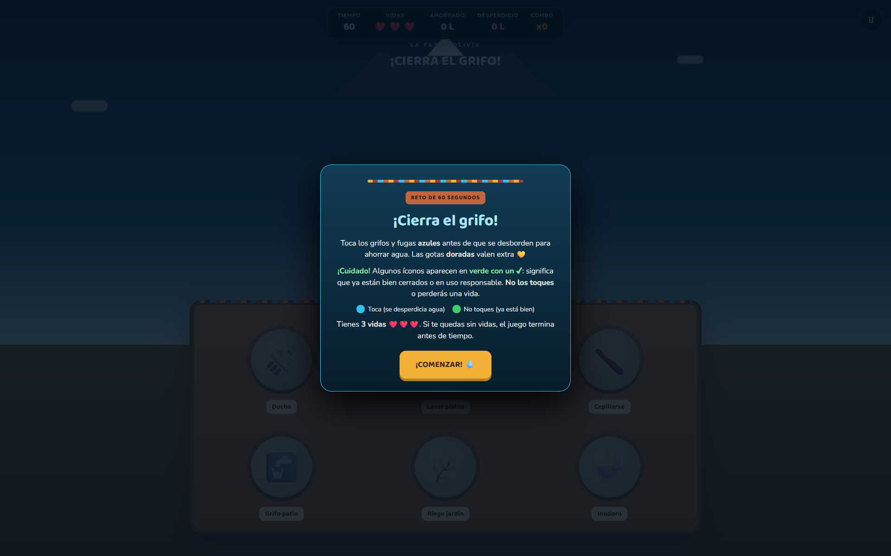
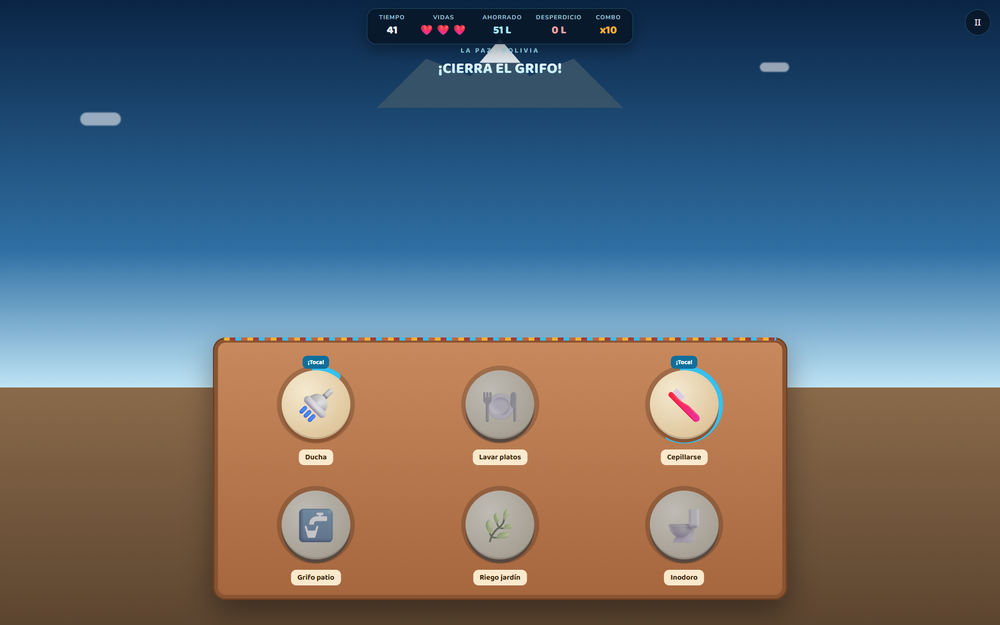
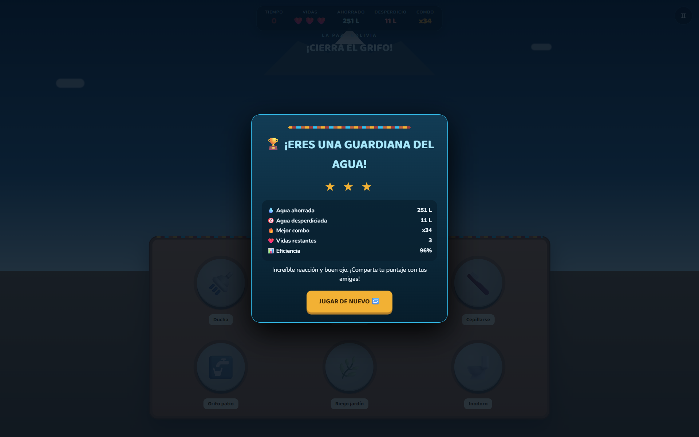

  

<h1 align="center">💧 ¡Cierra el Grifo! — La Paz</h1>

  
  
  

## 📖 Descripción

**¡Cierra el Grifo!** es un juego arcade ambientado en la ciudad de **La Paz, Bolivia**, que busca crear conciencia sobre el cuidado del agua.

- **¿De qué trata?** Un reto de 60 segundos donde aparecen grifos y fugas de agua (azules y dorados) que hay que "cerrar" a tiempo, junto con íconos verdes que ya están bien cerrados y **no deben tocarse**.
- **Objetivo del jugador:** Ahorrar la mayor cantidad de agua posible tocando solo los íconos de desperdicio antes de que se desborden, evitando tocar los íconos ya responsables (verdes ✔).
- **Mecánica principal:** Detección y reacción rápida — distinguir entre íconos "a tocar" (fuga activa) e íconos "a NO tocar" (ya en uso responsable), gestionando un combo y 3 vidas.

## 🎮 Controles

| Acción | Control |
|---|---|
| Cerrar grifo / fuga | `CLICK` o `TAP` sobre el ícono azul/dorado antes de que se desborde |
| Evitar error | No tocar los íconos verdes con ✔ (ya están bien) |
| Pausar | Botón `⏸` en la esquina superior |

## 🛠️ Tecnologías

- HTML5
- CSS3 (temática visual de La Paz: cielo, cerro Illimani, nubes animadas)
- JavaScript vanilla (temporizador, sistema de combos, vidas y estadísticas de agua ahorrada/desperdiciada)

## 📸 Capturas de pantalla

| Reglas iniciales | Gameplay | Resultados |
|---|---|---|
|  |  |  |

## ▶️ Jugar

Abre [`index.html`](./index.html) en tu navegador, o pruébalo en vivo (se abre en pestaña nueva) vía GitHub Pages:

<a href="https://TheStevenTL.github.io/MiPortafolioGameDevelopment/games/cierra-el-grifo-la-paz/" target="_blank" rel="noopener">https://TheStevenTL.github.io/MiPortafolioGameDevelopment/games/cierra-el-grifo-la-paz/</a>

## 💡 Qué aprendí

- Diseño de un sistema de recompensa/penalización con métricas visibles en tiempo real (agua ahorrada, desperdiciada, combo).
- Ambientación de un juego con identidad local (La Paz) mediante recursos gráficos simples en CSS.

## 🔧 Qué mejoraría en una siguiente versión

- Añadir niveles de dificultad con más tipos de fugas.
- Incluir datos reales sobre consumo de agua en La Paz al finalizar la partida.
- Sumar efectos de sonido y una tabla de mejores puntuaciones.

---
⬅️ [Volver al portafolio principal](../../README.md)
