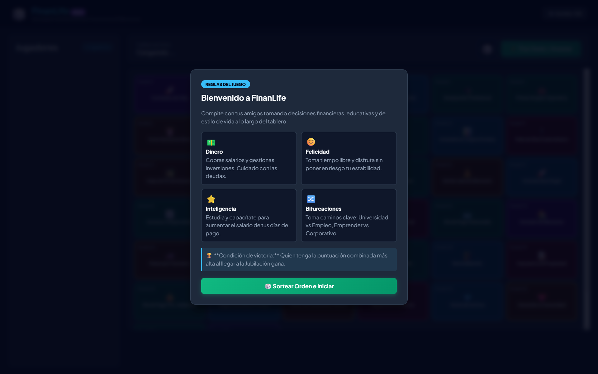
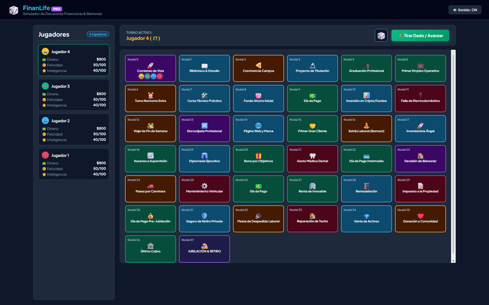
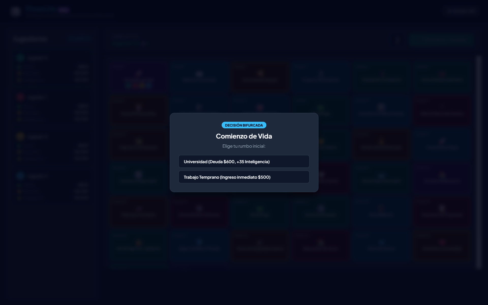

# FINANLIFE: DARK EDITION

Un tablero de vida financiera para 4 jugadores: de la universidad a la jubilación, tomando decisiones de dinero en el camino.

## Descripción

**FinanLife: Dark Edition** es un juego de tablero tipo *party game* inspirado en el formato de "El Juego de la Vida", centrado en decisiones de finanzas personales. Cuatro jugadores (en el mismo dispositivo, por turnos) recorren un camino de 38 casillas —desde el comienzo de la vida adulta hasta la jubilación— gestionando dinero, felicidad, inteligencia financiera y deuda.

- **De qué trata:** cada jugador avanza por el tablero tirando un dado, cobrando salario en las casillas de pago, enfrentando bifurcaciones de decisión (por ejemplo, Universidad con deuda e inteligencia extra, o Trabajo Temprano con ingreso inmediato) y oportunidades de inversión con costo y beneficio.
- **Objetivo del jugador:** llegar a la casilla final de Jubilación con la mejor puntuación posible, calculada a partir del dinero acumulado, la felicidad, la inteligencia financiera y penalizando la deuda pendiente.
- **Mecánica principal:** turnos por jugador con tirada de dado y desplazamiento casilla por casilla; distintos tipos de casilla (pago, oportunidad, estilo de vida, emergencia, bifurcación) disparan distintos eventos; las bifurcaciones abren un modal de decisión con costos y beneficios claros antes de continuar. Al terminar todos los jugadores, se calcula un marcador final con tabla de posiciones y confeti de celebración.

## Género

`Board Game` · `Party Game` · `Educativo` (finanzas personales)

## Motor / Tecnología

- HTML5 + CSS3 (paleta oscura con acentos neón por tipo de casilla, tipografía Plus Jakarta Sans)
- JavaScript vainilla (tablero de 38 nodos definido como datos, máquina de turnos)
- Sonido generado por síntesis con Web Audio API (sin archivos de audio externos)
- Librería externa `canvas-confetti` para la pantalla de victoria (vía CDN)

## Mecánicas

| Elemento | Detalle |
|---|---|
| Jugadores | 4, con avatar, color, dinero, felicidad, inteligencia y deuda propios |
| Tablero | 38 casillas en secuencia, con bifurcaciones de decisión |
| Tipos de casilla | Día de pago, oportunidad de inversión, estilo de vida, emergencia, bifurcación, meta |
| Turnos | Orden inicial aleatorio (Fisher-Yates), avance por turnos hasta que todos llegan a la meta |
| Puntuación final | Dinero acumulado + felicidad + inteligencia, con penalización por deuda |

## Controles

| Acción | Control |
|---|---|
| Iniciar partida | Clic en "Sortear Orden e Iniciar" |
| Tirar el dado | Clic en "Tirar Dado / Avanzar" |
| Elegir opción en una bifurcación | Clic en la opción del modal de decisión |
| Silenciar sonido | Clic en el botón "Sonido" de la cabecera |

## Capturas de pantalla

| Reglas | Tablero | Decisión |
|---|---|---|
|  |  |  |

*(Clic en cualquier captura para abrir el juego en línea.)*

## Cómo jugar

**[Jugar en línea](https://m4rcmob-afk.github.io/PenitenteForge/games/finanlife-dark-edition/)**, ver [README principal](../../README.md#cómo-jugar-importante)

También puedes descargar el repo y abrir `index.html` directamente en tu navegador.

## Notas de desarrollo

Con apoyo de IA se integraron en un solo archivo autocontenido las tres capas del proyecto (HTML, CSS y JavaScript) que originalmente estaban separadas, siguiendo el mismo formato que el resto de juegos del portafolio.

### Posibles mejoras

- Modo de 2-3 jugadores (actualmente fijo en 4).
- Guardar partidas en curso.
- Más eventos y bifurcaciones para aumentar la rejugabilidad.

