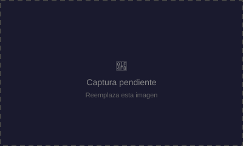

  

<h1 align="center">♻️ Trash Rush</h1>

  
  
  

## 📖 Descripción

**Trash Rush** es un juego arcade educativo de clasificación de residuos contrarreloj, a lo largo de 20 niveles de dificultad creciente.

- **¿De qué trata?** Cada ronda aparece un objeto de basura (ej. "Botella de vidrio de vino") y el jugador debe enviarlo al contenedor correcto antes de que se acabe el tiempo.
- **Objetivo del jugador:** Clasificar correctamente la mayor cantidad de residuos posible, superando los 20 niveles sin quedarse sin las 3 vidas disponibles.
- **Mecánica principal:** Reconocimiento y clasificación rápida por categoría (papel, plástico, vidrio, orgánico, metal, no reciclable) usando combinaciones de teclado.

## 🎮 Controles

| Contenedor | Control |
|---|---|
| 📄 Papel | `↑` Flecha arriba |
| 🧴 Plástico | `↓` Flecha abajo |
| 🍾 Vidrio | `←` Flecha izquierda |
| 🍎 Orgánico | `→` Flecha derecha |
| 🥫 Metal | `ESPACIO` + `←` |
| 🚬 Resto (no reciclable) | `ESPACIO` + `→` |

## 🛠️ Tecnologías

- HTML5
- CSS3 (temática de colores por tipo de contenedor, animaciones de feedback)
- JavaScript vanilla (sistema de niveles, temporizador por ítem y mapeo de controles combinados)

## 📸 Capturas de pantalla

| Guía inicial | Gameplay | Resultado final |
|---|---|---|
|  |  |  |

## ▶️ Jugar

Abre [`index.html`](./index.html) en tu navegador, o pruébalo en vivo (se abre en pestaña nueva) vía GitHub Pages:

<a href="https://TheStevenTL.github.io/MiPortafolioGameDevelopment/games/trash-rush/" target="_blank" rel="noopener">https://TheStevenTL.github.io/MiPortafolioGameDevelopment/games/trash-rush/</a>

## 💡 Qué aprendí

- Diseño de un sistema de dificultad progresiva (20 niveles) con reducción de tiempo disponible.
- Manejo de combinaciones de teclas simultáneas (`keydown`/`keyup`) para ampliar el número de acciones posibles con pocas teclas.

## 🔧 Qué mejoraría en una siguiente versión

- Agregar soporte táctil (arrastrar y soltar) para dispositivos móviles.
- Incluir datos educativos emergentes sobre cada tipo de residuo al acertar.
- Sumar tabla de puntuaciones y modo multijugador local.

---
⬅️ [Volver al portafolio principal](../../README.md)
